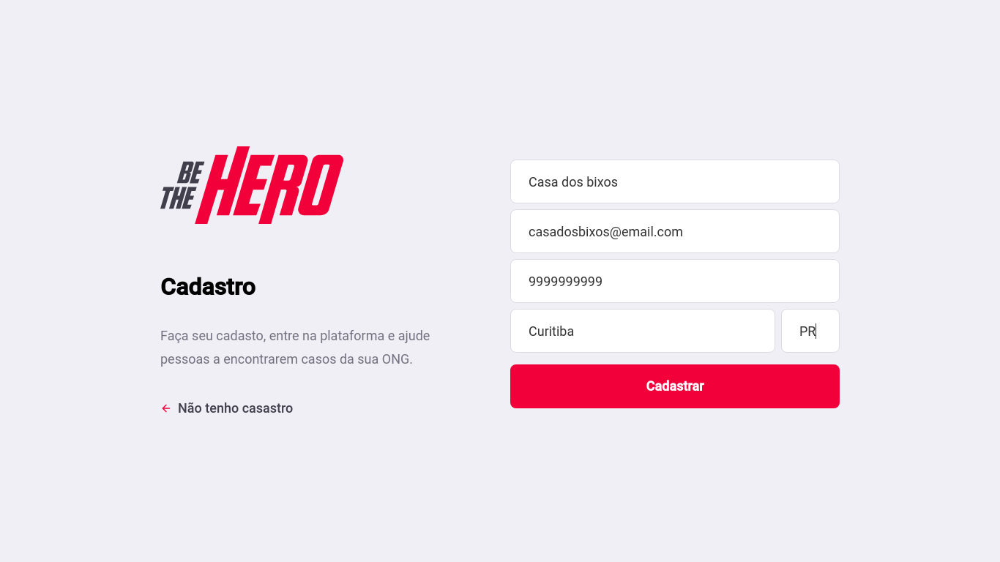
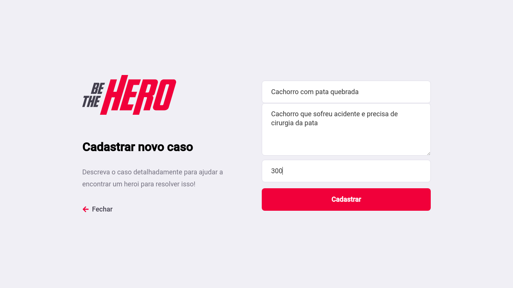
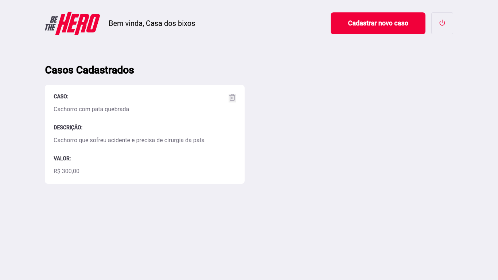

<h1 align="center" >Be The Hero</h1>

<h2 align="center">Seja um herói, ajuda quem precisa de ajuda</h2>

<p align="center">
    <a href="https://rocketseat.com.br">
        
    </a>
</p>

## Sumário

- [Sumário](#sumário)
- [:gift_heart: Sobre](#gift_heart-sobre)
- [:robot: Técnologias](#robot-técnologias)
- [:question: Como executar](#question-como-executar)
- [:computer: Web](#computer-web)
- [:iphone: Mobile](#iphone-mobile)

<a id="sobre"></a>
## :gift_heart: Sobre

<p>A <strong>Be The Hero</strong> é uma aplicação web e mobile destinada a ONGs e instituições que precisam de ajuda e pessoas que querem ajudar.</p>

<a id="tecnologias"></a>
## :robot: Técnologias

Durante a construção do projeto foram usadas várias técnologias:

- [Node.js](https://nodejs.org/en/)
- [ReactJS](https://reactjs.org/)
- [React Native](https://reactnative.dev/)

<a id="como-executar"></a>
## :question: Como executar

- ### **Requisitos**

    - Ter o [Node.js](https://nodejs.org/en/)
    - Ter um gerenciador de pacotes [NPM](https://www.npmjs.com/) ou [Yarn](https://yarnpkg.com/)
    - Ter o [Expo](https://expo.io/) (instalar de forma global)

- ### Faça um clone

```sh
  $ git clone https://github.com/jeovane16/be-the-hero.git
```

- ### Execute os comandos (de preferência na ordem mostrada) 

```sh
  # Instale as dependências do package.json
  $ npm install

  ## Crie o seu banco de dados
  $ cd backend
  $ npm run knex:migrate

  # Inicie o server
  $ npm start

  # Inicie a aplicação web
  $ cd frontend
  $ npm start

  # Inicie o app
  $ cd mobile
  $ npm start
```

<a id="web"></a>
## :computer: Web

<h1 align="center">
    
</h1>

<h1 align="center">
    
</h1>

<h1 align="center">
    
</h1>

<h1 align="center">
    
</h1>

<a id="mobile"></a>
## :iphone: Mobile

<h1 align="center">
    
</h1>

<h1 align="center">
    
</h1>

<h1 align="center">
    
</h1>